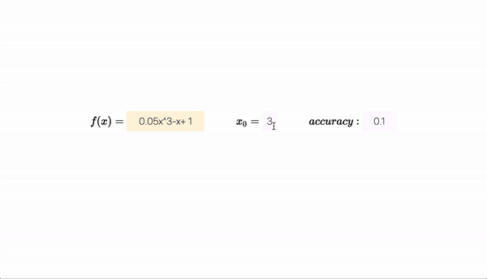

# Newton's-Method-Visualizer

This web app was made for my AP Calculus class. It computes and visualizes on a graph how Newton's method works.

> Newton's method is a root-finding algorithm which produces successively better approximations to the roots (or zeroes) of a real-valued function.

Try inputting your own functions!

# Usage

Enter a real-valued function, a starting point, and the accuracy (used to stop the algorithm). Press enter, and scroll down to see the magic!

